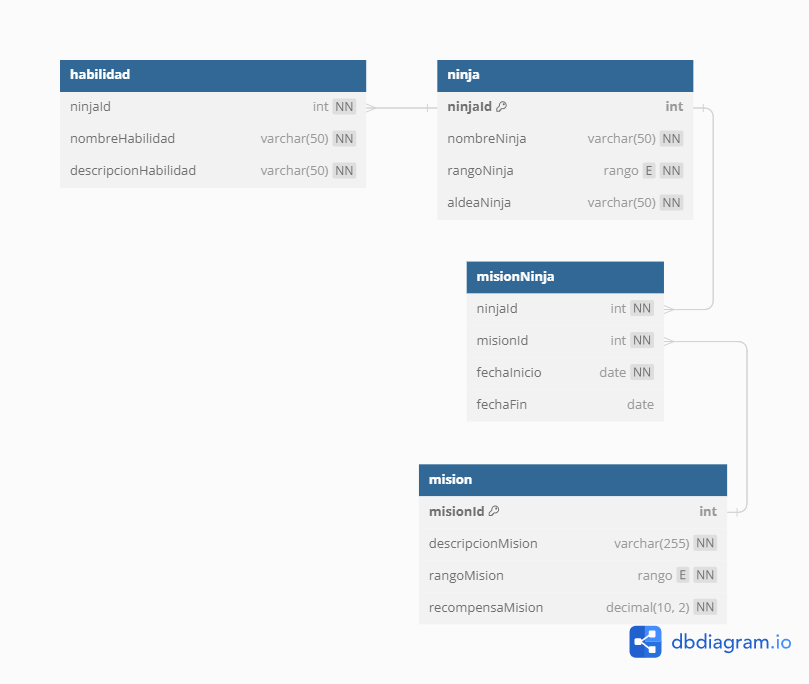
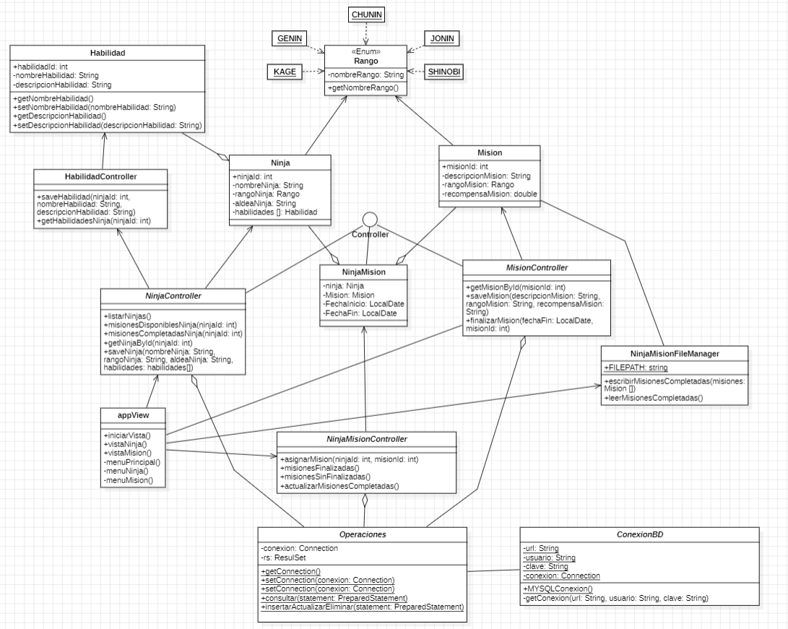

# Gestor Misiones Ninja

## Contexto
La aldea ninja de Konoha ha decidido modernizar su sistema de gestión de misiones y datos de los ninjas para mejorar la eficiencia y la coordinación entre los equipos. Se le ha encomendado la tarea de desarrollar una aplicación en Java que gestione esta información de manera integral. La aplicación deberá incluir manejo de archivos de texto, conexión a una base de datos MySQL mediante JDBC, seguir principios y patrones de diseño, y utilizar expresiones lambda y stream API para expresar operaciones de forma concisa. Además, la interfaz de usuario se realizará por consola para facilitar su uso.

### Herramientas utilizadas

- Lenguaje de programacion: JAVA
- Editor de codigo: Visual Studio Code
- Gestor Base de datos: MySQL
- Lenguaje consultas: SQL

### Principios

- Se utilizaron los principios SOLID de diseño de software que promueven la creación de sistemas más mantenibles y flexibles tales como el principio de Liskov con respecto al polimorfismo. Ademas, se promovio el uso de patrones de diseño tales como Singleton para la conexion a la base de datos.

- Se hizo uso de lambdas para utilizar el API STREAM, y manipular flujos de datos y obtener colecciones de datos.

- Se aplico el patron de arquitectura MVC (MODELO, VISTA, CONTROLADOR), el cual es un modelo de 3 capas que separa la logica del negocio de la vista.

### Diagrama Base de Datos Entidad-Relacion

La base de datos esta compuesta por cuatro (4) tablas con sus respectiva llaves foraneas, primarias y restricciones.

- Mision
- Ninja
- MisionNinja
- Habilidad

### Diagrama de Clases UML

